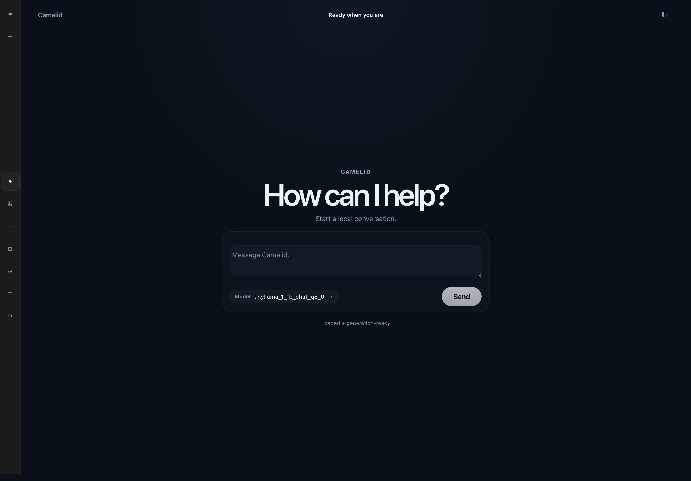

# Camelid

[![CI][ci-badge]][ci-workflow]

**Camelid is a Rust-native local inference backend for GGUF language models, built around evidence-backed support instead of optimistic compatibility claims.**

The project has a working server, OpenAI-compatible completions/chat endpoints, exact-row capability reporting, and a React/Vite WebUI. The core product rule is simple: a model row is supported only when runtime behavior, validation artifacts, API readiness, frontend readiness, and docs all agree.

## Benchmark Highlights

Camelid is working toward 1:1 behavioral parity with llama.cpp while keeping the implementation Rust-native. The first goal is verification, not speed theater: match the trusted local-inference baseline for exact rows, prove generated-token agreement where Camelid already agrees with it, and only then promote faster paths.

| Scope | Model / run | Camelid path | llama.cpp | Camelid | Takeaway |
| --- | --- | --- | --- | --- | --- |
| Verification first | Llama 3.2 1B, Llama 3.2 3B, and Llama 3 8B Q8_0 checked envelopes | Default supported path | Reference token IDs and text | Matching generated token IDs and text inside supported envelopes | Support moves only where exact-row parity, API, WebUI, and evidence agree. |
| Apple Silicon retained candidate | Llama 3.2 3B Q8_0 short request | Default-off Q8 lane | about 530 ms total | about 478 ms total | Narrow same-host result; total wall time improved, but first-token latency still trails llama.cpp. |
| Headline guarded stream run | Llama 3.2 3B Q8_0 | Confirmed experimental highlight | 5.60 s total | 3.01 s total | 46.4% faster with marker guards passing for both runtimes. |
| Current Ubuntu target | Llama 3.2 3B Q8_0 x86 route-map run | Default-off Rust Q8 optimization lane | 374.88 ms total | 413.42 ms total | Camelid trails by 10.3%; this is the active measured optimization target. |

> **Benchmark boundary:** these are retained highlights, not a broad production-throughput claim. Optimized paths are evidence-gated and default-off. Camelid promotes code to the default path only after exact-row parity, repeatability, portability, and support-contract checks all agree.

## What Works Today

Camelid can:

- load supported local GGUF model files
- generate through OpenAI-compatible completions and chat-completions APIs
- report exact-row model compatibility through `/api/capabilities`
- keep unsupported or unproven rows fail-closed
- expose the same support boundary in the WebUI
- validate supported rows against llama.cpp-backed parity artifacts before public support language moves

Camelid does **not** bundle model weights. Full local chat requires a supported GGUF already present on your machine.



*Camelid dark, collapsed-rail chat surface with local readiness and support-contract gating.*

## Support Matrix

Camelid's support boundary is exact-row only. Read each row literally; support does not inherit across nearby model sizes, variants, quantizations, tokenizer lanes, or GGUF files.

| Exact row | Public status | Current evidence boundary |
| --- | --- | --- |
| TinyLlama 1.1B Chat Q8_0 | **Verified support** | End-to-end generation, broader five-prompt/50-token parity, template-shape checks, bounded 512-context coverage, API/WebUI alignment, and RSS/perf sampling. |
| Llama 3.2 1B Instruct Q8_0 | **Verified bounded support** | Load, completions, chat completions, WebUI validation, compact/broader parity, exact-row metadata-Jinja row-template checks, template-shape checks, unique-chat perf/RSS sampling, and checked 512/1024/2048/4096/8192 context packs. |
| Llama 3.2 3B Instruct Q8_0 | **Supported exact-row smoke** | Canonical API/WebUI support-gate refresh at source head `e9f926ed1a65`, compact/broader 50-token parity, five-prompt API smoke, row-scoped template evidence, bounded unique-chat perf/RSS, and checked 512/1024/2048 context packs. |
| Llama 3 8B Instruct Q8_0 | **Verified bounded support** | Load, completions, chat completions, WebUI validation, compact and broader parity, checked 512/1024/2048 context packs, compact chat-template-shape evidence, bounded memory evidence, structured RSS/Q8 read counters, and lazy-Q8 hot-path measurements. |
| Mistral-7B-Instruct-v0.3.Q8_0.gguf | **Active validation; not supported yet** | Tokenizer/template, 1-token generation, broader five-prompt/50-token parity, bounded 512/1024/2048, checked 4096/8192 context evidence, and fail-closed API/WebUI/RSS evidence exist. Explicit contract promotion is still required. |
| Mixtral-8x7B-Instruct-v0.1.Q8_0.gguf | **Partial backend runtime only** | One-token backend MoE runtime evidence exists. Later-generation divergence and a continuation HTTP hang block API/WebUI/frontend readiness and support promotion. |
| Qwen2.5-7B-Instruct-Q8_0.gguf | **Planned exact-row candidate** | Candidate row selected; no Camelid support claim yet. |
| gemma-2-9b-it-Q8_0.gguf | **Planned exact-row candidate** | Candidate row selected; no Camelid support claim yet. |
| Fortytwo-Network/Strand-Rust-Coder-14B-v1 | **Planned Rust-coder validation target** | Selected for future validation; no load, tokenizer, GGUF, parity, API, WebUI, RSS, or throughput evidence is claimed yet. |

Current limitations are intentional:

- checked context packs are bounded validation buckets, not model-native context claims
- broad arbitrary/Jinja-template behavior is not generally supported
- production throughput is not claimed for the supported rows
- portability beyond the validated lanes remains gated
- neighboring GGUFs and other quantizations remain unsupported until they have their own evidence

Authoritative detail lives in [`COMPATIBILITY.md`](COMPATIBILITY.md). The current evidence checkpoint lives in [`STATUS.md`](STATUS.md), and delivery sequencing lives in [`ROADMAP.md`](ROADMAP.md).

## Active Work

The current workstream is focused on widening support without weakening the contract:

- **Protect supported rows:** keep TinyLlama, Llama 3.2 1B/3B, and Llama 3 8B evidence aligned across runtime, API, frontend, and docs.
- **Close Mistral deliberately:** Mistral 7B v0.3 Q8_0 has much of the validation work done, but still needs explicit synchronized promotion before the product can call it supported.
- **Fix Mixtral blockers:** Mixtral remains blocked until later-generation parity and the continuation HTTP hang are fixed and rerun through API/WebUI/frontend evidence.
- **Advance Q8 performance carefully:** Apple Silicon and Ubuntu x86 Q8 acceleration remain default-off and evidence-gated. The default/reference path stays available while optimized paths prove parity and whole-model impact.

## Performance Snapshot

Camelid's speed story is still in progress. The best current performance evidence is narrow and default-off:

- Apple Silicon Q8 work has a retained Llama 3.2 3B short-request candidate that improved total wall time in a bounded run, but first-token latency and decode-heavy runs still need work before production-throughput language is justified.
- Ubuntu x86 Q8 work has packed storage, AVX2/VNNI-oriented kernels, route telemetry, and FFN decode-chain experiments behind gates, but no broad default-on speed claim.

For details, see [`docs/performance/ubuntu-x86-q8.md`](docs/performance/ubuntu-x86-q8.md) and [`STATUS.md`](STATUS.md#ubuntu-x86-q8-acceleration-update).

## Why Camelid Exists

Local AI adoption needs more than a model that runs once. Teams need a runtime that can say exactly what works, refuse to overclaim unsupported rows, and keep the backend, API, UI, docs, and validation evidence in sync.

Camelid's wedge is that trust contract:

- exact support rows instead of family-wide guesses
- fail-closed readiness for unproven models
- OpenAI-compatible APIs for existing tools and agent stacks
- a WebUI that reflects runtime truth instead of pretending every local model is ready
- visible third-party credit and parity checks against llama.cpp / ggml where those references anchor support

**Naming note.** Camelid is the product name. The repository, crate, binary, and diagnostics use `camelid`.

**Reference credit.** Camelid is original Rust code and keeps visible credit for the reference work behind tokenizer checks, compatibility baselines, and parity evidence. See [`THIRD_PARTY_NOTICES.md`](THIRD_PARTY_NOTICES.md) for current acknowledgements and MIT-license notices, including llama.cpp / ggml.

## Start Here

- [`COMPATIBILITY.md`](COMPATIBILITY.md) — authoritative support matrix and promotion rules
- [`STATUS.md`](STATUS.md) — current evidence boundary, recent moves, and blockers
- [`ROADMAP.md`](ROADMAP.md) — delivery plan of record
- [`docs/CONTRIBUTOR_QUICKSTART.md`](docs/CONTRIBUTOR_QUICKSTART.md) — shortest safe local path
- [`docs/VALIDATION_MATRIX.md`](docs/VALIDATION_MATRIX.md) — expected checks by change type
- [`CONTRIBUTING.md`](CONTRIBUTING.md) — contribution expectations and PR guidance
- [`DOCS.md`](DOCS.md) — full documentation map

## Quickstart

This quickstart verifies that Camelid builds cleanly, starts the backend, and returns a live API response. It is intentionally simple and honest: the repository does not bundle supported GGUF model files, so full local chat requires a supported GGUF already present on your machine.

### 1) Build and run the server

```bash
git checkout main
git pull --ff-only
cargo build --release --bin camelid
target/release/camelid serve --model /path/to/model.gguf
```

`serve --model` loads the model at startup and lets Camelid choose the safest validated execution plan for the current host. The default profile is `auto`; low-level environment variables remain developer overrides, not normal setup.

If you only want to bring up the API without a model:

```bash
target/release/camelid serve --addr 127.0.0.1:8181
```

Toolchain note: Camelid currently requires Rust/Cargo 1.87+. If your host exposes an older system `cargo`, use the rustup-managed toolchain described in [`docs/CONFIGURATION.md`](docs/CONFIGURATION.md).

### 2) Verify the server is responding

From another shell:

```bash
curl -s http://127.0.0.1:8181/api/capabilities
```

Success looks like a live JSON capability response from Camelid. That confirms the backend is up and the product surface is reachable.

### 3) Before you expect local chat to work

You will need:

- a supported GGUF model file already present on your machine
- the model path passed with `--model`, or loaded later through the model API/UI
- any extra contributor setup described in [`docs/CONTRIBUTOR_QUICKSTART.md`](docs/CONTRIBUTOR_QUICKSTART.md) and [`docs/CONFIGURATION.md`](docs/CONFIGURATION.md)

For a first supported local run, TinyLlama is the clearest path. It is **not bundled** in this repository, but once you have a supported GGUF locally, Camelid is designed to make the readiness boundary explicit instead of guessing.

## Frontend

Camelid includes a built-in React/Vite frontend in [`frontend/`](frontend/) so the local runtime ships with a real product surface, not just a backend API.


The UI is designed to feel straightforward and approachable while still staying honest about model readiness. It keeps the main path simple — pick a local model, see whether Camelid reports it as ready, and start chatting when the runtime and support contract agree.

A few principles define the WebUI:

- **Chat-first and intuitive:** the interface emphasizes the primary action instead of burying it in operator-only controls.
- **Honest readiness signals:** chat only unlocks when the loaded model is runtime-ready and matched to an exact supported support-contract row.
- **One product story across surfaces:** the backend, API, UI, and docs are intended to agree instead of sending mixed signals about what is actually supported.

```bash
cd frontend
npm ci
npm run dev
```

By default, the UI talks to `http://127.0.0.1:8181` and only unlocks local chat when the loaded model is both runtime-ready and covered by the current support contract.

See [`frontend/README.md`](frontend/README.md) for frontend-specific details.

## How support moves

A row is promoted only when all of these agree for the exact lane being claimed:

1. runtime behavior
2. artifact-backed validation
3. documentation
4. API capability reporting
5. frontend readiness behavior

That is Camelid’s core discipline: **evidence first, broader claims later**.

## Contributing

If you want to contribute, start with the docs written for safe local iteration and contributor onboarding:

- [`docs/CONTRIBUTOR_QUICKSTART.md`](docs/CONTRIBUTOR_QUICKSTART.md)
- [`docs/CONFIGURATION.md`](docs/CONFIGURATION.md)
- [`docs/VALIDATION_MATRIX.md`](docs/VALIDATION_MATRIX.md)
- [`CONTRIBUTING.md`](CONTRIBUTING.md)

Camelid intentionally separates the public support contract, the local contributor path, and maintainer-only evidence workflows. That keeps the project welcoming without leaking operator-only details or pretending every internal validation lane is part of normal onboarding.

## Validation

Use [`docs/VALIDATION_MATRIX.md`](docs/VALIDATION_MATRIX.md) to pick the smallest correct validation lane for your change.

Common baseline checks:

```bash
cargo fmt --all -- --check
cargo clippy --all-targets --all-features -- -D warnings
cargo test --all-targets --all-features
cargo doc --no-deps --all-features
bash scripts/check-public-scrub.sh
```

For docs-only changes, the minimum expected checks are:

```bash
git diff --check
bash scripts/check-public-scrub.sh
```

If your change affects the frontend, also run:

```bash
cd frontend
npm ci
npm run build
```

## Documentation map

- [`DOCS.md`](DOCS.md) — full documentation index
- [`COMPATIBILITY.md`](COMPATIBILITY.md) — support ledger
- [`STATUS.md`](STATUS.md) — current evidence snapshot
- [`ROADMAP.md`](ROADMAP.md) — delivery plan of record
- [`FULL_SUPPORT_BLOCKER_MATRIX.md`](FULL_SUPPORT_BLOCKER_MATRIX.md) — row-by-row missing evidence for broader promotion
- [`ARCHITECTURE.md`](ARCHITECTURE.md) — architecture and module planning
- [`DECISIONS.md`](DECISIONS.md) — design decision log

## License and acknowledgements

Camelid is licensed under the [MIT License](LICENSE).

Camelid is inspired by and validated against [`llama.cpp`](https://github.com/ggml-org/llama.cpp), which is licensed under the MIT License:

> Copyright (c) 2023-2026 The ggml authors

The llama.cpp project and the broader GGUF ecosystem made the modern local-model path practical. Camelid keeps its runtime implementation Rust-native while intentionally crediting llama.cpp wherever reference comparisons, tokenizer fixtures, and parity gates rely on it.

[ci-badge]: https://github.com/timtoole02/Camelid/actions/workflows/ci.yml/badge.svg
[ci-workflow]: https://github.com/timtoole02/Camelid/actions/workflows/ci.yml
